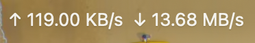
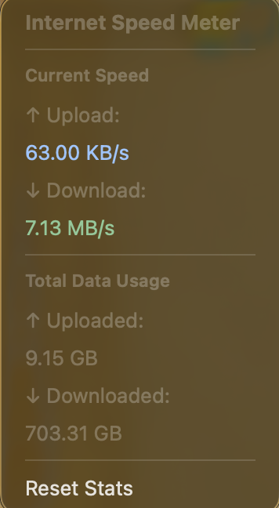

<div align="center">
  
  
  # Internet Speed Meter for macOS
  
  A lightweight, real-time internet speed monitor that lives in your macOS menu bar. Track your download/upload speeds and total data usage at a glance.
  
  
  
  
</div>

## ✨ Features

- 📊 **Real-time Speed Monitoring** - Live download and upload speeds updated every second
- 📈 **Total Data Usage Tracking** - Cumulative data transfer statistics across sessions
- 🎯 **Menu Bar Integration** - Clean, minimal interface that doesn't clutter your workspace
- 💾 **Persistent Storage** - Your data usage stats are saved and restored between sessions
- 🔄 **Reset Capability** - Clear statistics anytime with a single click
- 🎨 **Native macOS Design** - Built entirely with SwiftUI for optimal performance
- 🔒 **Privacy First** - All data stays on your Mac, no external connections required

## 📸 Screenshots

<div align="center">
  
  <p><em>Internet Speed Meter running in the macOS menu bar</em></p>
  <br/>
  
  <p><em>Real-time speed monitoring and cumulative data statistics</em></p>
</div>

## 🔧 Requirements

- macOS 13.0 (Ventura) or later
- Apple Silicon or Intel Mac
- No additional dependencies or frameworks needed

## 📥 Installation

### Option 1: Download Pre-built App
1. Download the latest release from [Releases](../../releases)
2. Unzip the downloaded file
3. Move `InternetSpeedMeterApp.app` to your Applications folder
4. Right-click the app and select "Open" (first launch only to bypass Gatekeeper)

### Option 2: Build from Source
```bash
# Clone the repository
git clone https://github.com/<username>/InternetSpeedMeterApp.git
cd InternetSpeedMeterApp

# Open in Xcode
open InternetSpeedMeterApp.xcodeproj

# Build and run (⌘+R)
```

## 🚀 Usage

1. **Launch the App** - It will appear in your menu bar with the app icon
2. **View Statistics** - Click the menu bar icon to see:
   - Current download speed (KB/s, MB/s)
   - Current upload speed (KB/s, MB/s)
   - Total data downloaded (session + historical)
   - Total data uploaded (session + historical)
3. **Reset Statistics** - Use the "Reset Statistics" button to clear all counters

## 🛠️ Technical Details

### Architecture
- **SwiftUI** - Modern declarative UI framework
- **Network Framework** - Native macOS network statistics
- **Combine** - Reactive data flow for real-time updates
- **UserDefaults** - Persistent storage for cumulative statistics

### How It Works
The app monitors network interface statistics using macOS's built-in network monitoring capabilities. It:
1. Reads system-level network byte counters
2. Calculates speed by measuring changes over time
3. Updates the UI in real-time (1-second intervals)
4. Persists cumulative totals to UserDefaults

## 🛡️ Privacy

This app is designed with privacy in mind:
- ✅ Only monitors network statistics from your system
- ✅ Does NOT collect or transmit any personal data
- ✅ Does NOT track your browsing activity or inspect traffic content
- ✅ Does NOT require internet connection
- ✅ All data stored locally on your Mac using UserDefaults
- ✅ No analytics, tracking, or third-party services

See [PRIVACY.md](PRIVACY.md) for complete privacy policy.

## 🤝 Contributing

Contributions are welcome! Here's how you can help:

1. **Report Bugs** - Open an issue with details about the problem
2. **Suggest Features** - Share your ideas for improvements
3. **Submit Pull Requests** - Fix bugs or add new features
4. **Improve Documentation** - Help make the docs better

### Development Setup
```bash
git clone https://github.com/<username>/InternetSpeedMeterApp.git
cd InternetSpeedMeterApp
open InternetSpeedMeterApp.xcodeproj
```

## 📄 License

This project is licensed under the MIT License - see the [LICENSE](LICENSE) file for details.

##  Support

If you encounter issues or have questions:
- 🐛 [Report a Bug](../../issues/new?labels=bug)
- 💡 [Request a Feature](../../issues/new?labels=enhancement)
- 💬 [Start a Discussion](../../discussions)

---

**Made with ❤️ for macOS** | [Report Issue](../../issues) | [Request Feature](../../issues/new?labels=enhancement)
